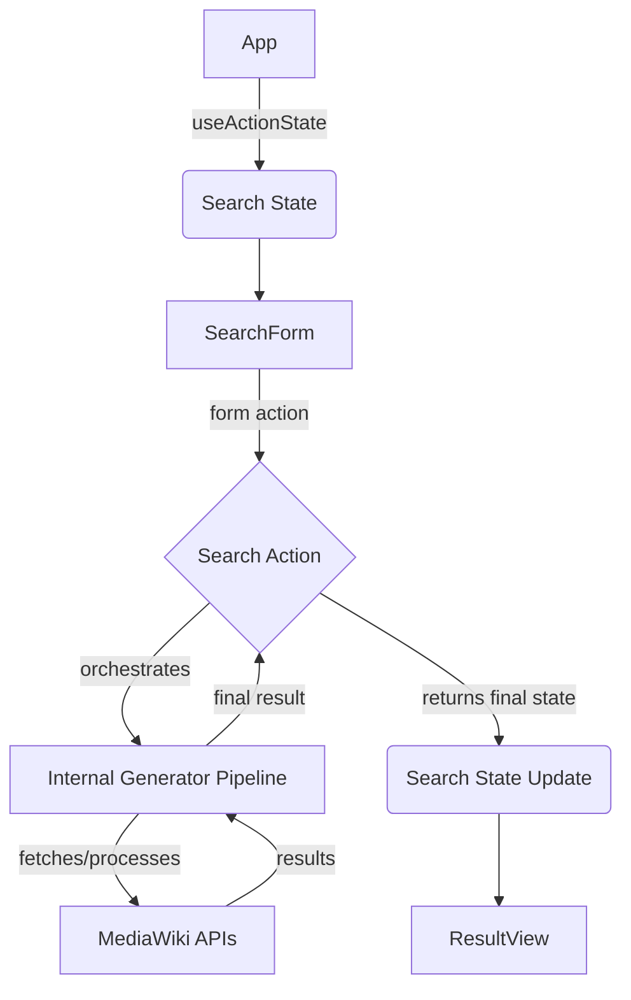

# Wikipedia Blame: Data Fetching Architecture

## Overview

This document outlines the current architecture,
leveraging React v19's `useActionState` hook for form handling and state management,
combined with internal use of `AsyncGenerator` for efficient data processing within the search action.

## Core Architectural Principles

### 1. Form-Action Integration

- Use `useActionState` for unified form submission and state management.
- Eliminate manual loading state handling at the component level.
- Collocate primary data fetching orchestration logic within the action function.

### 2. Streamlined Data Flow

- The main action function manages the overall search lifecycle orchestration.
- `useActionState` provides a single point for final state updates to the UI.
- Clear, unidirectional data progression from user input to final result state.

### 3. Efficient Data Processing with Generators

- Internal functions (`fetchAllRevisions`, `fetchRevisionTexts`, `findOneOccurrence`) utilize `AsyncGenerator` extensively.
- Revision IDs and content are fetched and processed in batches/streams, minimizing memory usage for large histories.
- The action function consumes this generator pipeline, awaiting the final result.

## Component Interaction Flow

> [!Note]
> While the overall flow uses `useActionState` with a single final state update,
> the "Search Action" internally uses an `AsyncGenerator` pipeline (`fetchAllRevisions`, `fetchRevisionTexts`, `findOneOccurrence`)
> to efficiently process potentially large revision histories in batches.

## Key Implementation Strategy

### Search Action Function (`searchAction`)

- Handles the complete search workflow orchestration:
	1. Input validation.
	2. Calls `fetchAllRevisions` (an `AsyncGenerator`) to get a stream of revision IDs.
	3. Passes the revision ID stream and `fetchRevisionTexts` (another `AsyncGenerator`) to `findOneOccurrence`.
	4. `findOneOccurrence` consumes these generators, processing revisions in batches to find the target text efficiently.
	5. Awaits the final result (found revision ID or null) from `findOneOccurrence`.
- Handles optional `uptoRevId` form input to limit the revision range.
- Returns a single, comprehensive final `SearchState` object compatible with `useActionState`.

### Internal Generators (`fetchAllRevisions`, `fetchRevisionTexts`, `findOneOccurrence` helpers)

- **`fetchAllRevisions`:** Fetches revision IDs page by page from the API, yielding IDs as an `AsyncGenerator`.
- **`fetchRevisionTexts`:** Fetches content for batches of revision IDs using streaming JSON parsing, yielding `RevisionResult` objects as an `AsyncGenerator`.
- **`findOneOccurrence` & Helpers:** Consumes the revision ID generator, batches them, uses the `fetchRevisionTexts` generator to get content, applies the search predicate, and returns the first match found.

### Component Responsibilities

- **App:** Manages state via `useActionState` hook, consuming the final state from `searchAction`.
- **SearchForm:** Collects user input (wiki, title, text, order, optional 'up to revision ID'), triggers the action.
- **ResultView:** Renders the final search result or error state.

## Technical Stack

- React v19 (`useActionState`)
- TypeScript
- `AsyncGenerator` for internal data processing
- Fetch API (with streaming JSON parsing)

## Benefits

- Improved state collocation via `useActionState`.
- Simplified async handling at the component level.
- Built-in pending/loading states from `useActionState`.
- **Optimistic UI updates** managed by `useActionState`.
- **Efficient handling of large revision histories** via internal `AsyncGenerator` pipelines, minimizing memory footprint.
- Enhanced user experience through clear state transitions.

## Future Considerations

- Exposing intermediate progress states (would require changing `searchAction` to be a generator itself and adapting state management).
- Advanced caching strategies.
- More robust error handling granularity.
- Internationalization support.
- **Server and client rendering compatibility** exploration.
- Ensuring **graceful degradation** in various scenarios (e.g., JavaScript disabled, API errors).
- Potential use of Server Components.
