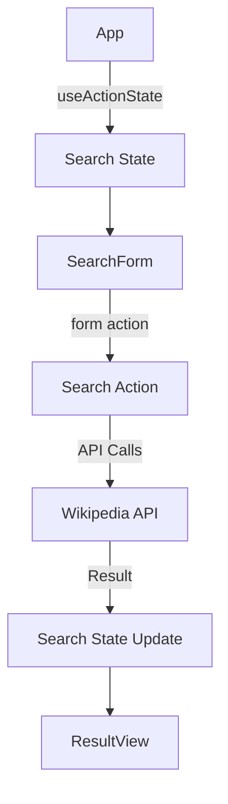

# Action-State Driven Data Fetching Plan for Wikipedia Blame

## Overview

This document outlines the current architecture, leveraging React v19's `useActionState` hook to create a modern, efficient data fetching strategy for the Wikipedia Blame application.

## Core Architectural Principles

### 1. Form-Action Integration
- Use `useActionState` for unified form submission and state management
- Eliminate manual loading state handling
- Collocate data fetching logic within action function

### 2. Streamlined Data Flow
- Action function manages entire search lifecycle
- Single point of state updates
- Clear, unidirectional data progression

### 3. Progressive Enhancement
- Optimistic UI updates
- Server and client rendering compatibility
- Graceful degradation

## Component Interaction Flow

## Key Implementation Strategy

### Search Action Function
- Handles complete search workflow:
  1. Page ID retrieval
  2. Revision fetching
  3. Occurrence finding
- Returns comprehensive search state

### Component Responsibilities
- App: State management
- SearchForm: User input collection
- ResultView: Result rendering

## Technical Stack
- React v19
- TypeScript
- Fetch API
- Server Components (optional)

## Benefits
- Improved state collocation
- Simplified async handling
- Built-in loading states
- Enhanced user experience

## Future Considerations
- Advanced caching
- More robust error handling
- Internationalization support
